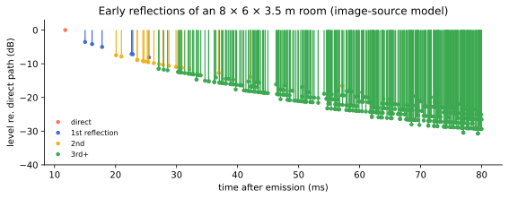

# Rooms

Every scene you've built so far takes place in deep space. Perfectly
placed sources, correct distance chains — and no *there* there, because
in real life almost nothing reaches your ears exactly once. The floor,
the walls, the ceiling all answer, and that answer is most of what
"sounding like a place" means. It's also, on headphones, the strongest
lever on **externalization**: dry binaural sources love to collapse into
your skull; give them a floor reflection and they step back outside.

Companion patch: **`patchers/booklet/06-rooms.maxpat`**.

## What a room does, on a clock

Clap once in a rectangular room and the reply has anatomy — here rendered
by the library's own room model (an 8 × 6 × 3.5 m room; every dot is one
mirror-image copy of the source):



- **The direct sound** arrives first — alone, and the ear's localization
  locks onto it (the precedence effect, working *for* you this time).
- **Early reflections** follow within tens of milliseconds: first the
  floor and nearest walls, sparse and loud, each from a definite
  direction. These carry the room's *size and shape* — and the source's
  position in it.
- **The tail**: reflections of reflections, thickening (the figure's
  green wall) into a directionless wash whose decay time — **RT60**, the
  time to fall 60 dB — is the one number everyone quotes about a room.

A convincing room needs all three, with the right directions on the
early part — which is exactly why doing this *in ambisonics* is special:
the reflections are placed on the sphere like any other source, so the
room turns with the scene when you rotate, and decodes to any rig.

## One object, one room

`ambitap.room~` is a mono-in, bus-out room simulator: direct path +
image-source early reflections + a 16-line feedback-delay-network tail,
all SH-domain, all on one HOA cord:

```text
[click~ / your source]
    |
[ambitap.room~ 3]          ← creation arg: order (max 3)
    |
   bus …
```

You describe the *situation*, not the effect: `dim_x/y/z` (the room, in
meters), `source_x/y/z`, `listener_x/y/z` (positions in it), and `rt60`
(seconds). The object derives the reflection pattern from the geometry —
move `source_x` and the early reflections re-aim themselves, which no
"stereo reverb on a send" can do.

The taste controls:

- **`direct` / `er` / `tail` toggles** — the anatomy, soloable. The
  fastest way to *learn* rooms is `er` alone while moving the source;
  the fastest way to *mix* them is `tail` down when the wash swallows
  clarity.
- **`gain`** — the wet level overall.
- **`rt60band <hz> <sec>`** — per-band decay (bright rooms decay treble
  fast; state it per band rather than faking it with EQ).
- **`reflections <6 floats>`** — per-wall reflection coefficients
  (deaden the ceiling, liven the floor).
- **`absorption fir|iir`** — quality/CPU switch for the tail's absorption
  filters: `fir` (default) is the verified linear-phase set; `iir` is
  far cheaper and trades exact mid-band RT60. On a laptop full of
  rooms, `iir` is the honest setting.

Two costs to know about, stated plainly because the object won't hide
them: the room adds a **fixed ~53 ms of latency** at 48 kHz (an
alignment inherent to the verified design — fine for composition and
installation, wrong for monitoring a live input through it), and
convolution makes it one of the package's **heavier objects** — budget
rooms like you budget reverbs, not like you budget filters.

## Using it like a mixer, not a physicist

- **One room, many sources** is the normal architecture: sources that
  share a space should share a `room~`'s *tail*. The object is mono-in,
  so the practical pattern for N sources in one room is: give the
  *featured* source (or two) its own fully-positioned `room~`, and let
  the rest share one room fed by a mono sum — ears forgive shared early
  reflections far more than they forgive N different rooms.
- **Dry/wet is `direct` versus the rest.** The object renders the direct
  path too, so a source can run *entirely* through it; or kill `direct`
  and treat it as a pure send alongside your Chapter 9/10 chain.
- **Match the room to the claim.** The distance chapter's cue #3 —
  direct-to-reverb ratio — now works: a source far away in the *room
  coordinates* automatically gets more room than source. Set the
  geometry to agree with your `distance~` settings and the illusion
  compounds; contradict it and ears notice something is off without
  knowing what.
- **Design visually when geometry gets fiddly:** the package ships
  `patchers/ambitap.roomdesigner.maxpat` — a floor-plan widget wired to
  a live `room~`, with the reflection pattern overlaid (the same
  image-source data as this chapter's figure).

The companion patch is the anatomy lesson: a click source in a
parametric room, the three-way toggles, and source-position controls.
Spend two minutes moving the source with only `er` on — hearing the
reflection pattern lean and stretch as geometry changes is the moment
rooms stop being "reverb" and become *places*.

> **For the curious.** Early reflections come from the image-source
> method (Allen & Berkley 1979): mirror the source across each wall,
> recursively, and every mirror image is a straight-line arrival — the
> figure plots exactly that enumeration. The tail is a feedback delay
> network (Jot's lineage) built in the SH domain so late energy stays
> properly diffuse *on the sphere*. The library selected and verified
> this architecture against a measured-behavior harness (R1–R10, in the
> repo's docs) — including that the FDN's decay actually hits the
> requested RT60.

## Checkpoint

Rooms are direct + early + tail; the earlies carry geometry and are the
externalization lever; `room~` renders all of it onto the bus from a
physical description, rotatable and decodable like everything else. Your
scenes now have places to happen in — time to get them out of the
headphones properly. Next: decoding to real arrays, done right.
