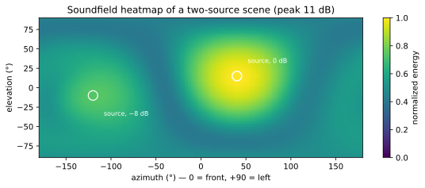

# Watching the scene

Stereo engineers get meters, goniometers, spectrograms — a whole cockpit.
Your medium so far has been sixteen channels of abstractly-aimed
microphones, monitored through borrowed ears. When something is wrong
("why is the mix left-heavy? *is* it left-heavy?") you need instruments
that answer about the *scene*, not about channel voltages. The package
ships two, plus a set of gauges to put them on screen.

Companion patch: **`patchers/booklet/09-watching.maxpat`**.

## The compass: `ambitap.energyvec~`

The scene's **energy vector** is the loudness-weighted average direction
of everything sounding — "where is the center of acoustic mass right
now?" `ambitap.energyvec~` computes it continuously: the bus goes in,
three *signals* come out — x (front), y (left), z (up) — each in
−1…+1, smoothed over an adjustable `smoothing_time`.

One dominant source: the vector points at it (this is real
direction-finding — the library verifies its DOA tracking against ground
truth). A balanced full mix: the vector hovers near zero, and *that* is
its quiet everyday use — a **balance meter for the sphere**. A mix that
drifts left-heavy shows as y creeping positive long before you'd swear
to it by ear. Because the outputs are signals, they're also patchable
*material*: run y into a panner, a filter, a projector via OSC — the mix
analyzing itself back into the art.

## The map: `ambitap.grid~`

Where the compass gives one arrow, `ambitap.grid~` gives the weather
map: it integrates the bus into a directional energy image — azimuth
across, elevation down, brightness = energy — the analysis behind this
figure (two noise sources, one 8 dB quieter; the white circles mark
their true positions):

Note the honest blur: at order 3 each source paints a ~75°-wide blob
(Chapter 7, now visible). You read this display for *structure*, not
pinpoints: how many things, roughly where, how dominant, and whether
energy lives where you think it does — the −8 dB source is plainly
there, plainly secondary, plainly rear-right.

Mechanically the object is a passthrough plus a reporter: the bus flows
through unchanged; `bang` it (a `qmetro 50` — display rate, not audio
rate) and it emits a `grid <rows> <cols> <peak_db> <values…>` list —
normalized energies ready for any display you like. Attributes:
`azimuth_steps` (resolution), `smoothing_time` (integration — long for
mix balance, short for watching movement), `dynamic_range` (how many dB
the brightness axis spans).

## The cockpit

Lists and signals are instrument *feeds*; the package also ships the
gauges. Built with the externals (`-DAMBITAP_MAX_BUILD_UI=ON`, the
default when node is present) is a set of `v8ui` widgets — a
drag-to-aim **panner**, the **heatmap** (consuming exactly `grid~`'s
list), a **DOA dot** fed by `energyvec~`, per-speaker **layout meters**
for the decoder, and a **rotation ball** for `rotate~` — with
`patchers/ambitap.ui-tour.maxpat` wiring all of them to a live scene at
once. The same widget set runs in a web browser as a remote control
surface over OSC (the library repo's `ui/` layer). This book won't
re-document them — open the tour patch — but the companion patch embeds
the two essentials (heatmap + DOA) next to their raw-data views so you
can see the plumbing.

## A monitoring practice

Instruments matter only inside a habit. A practice that fits on an index
card:

1. **Park the compass on the master bus, always** — smoothing ~1 s. Its
   job is the slow question: is the mix balanced on the sphere? Glance
   at it like you glance at a master meter.
2. **Raise the map when you're placing or hunting** — smoothing short.
   Two uses: confirm a placement went where you sent it (a `distance~`
   typo that mutes a source is instantly visible as a missing blob),
   and find the *actual* direction of something misbehaving before
   reaching for `vmic~` (next chapter) to solo it.
3. **Trust ears over instruments, in that order.** The map shows
   energy, not perception: a 40°-wide blob can *localize* rock-solid
   (Chapter 7's max-rE psychoacoustics don't render on a heatmap), and
   the compass reads a hard-left source and a balanced chorus as the
   same near-zero when both coexist. Instruments answer "what is
   there"; only monitoring answers "how does it read."
4. **Meter the channels too, occasionally.** Plain `mc.meter~` on the
   bus still catches the prosaic disasters — a runaway encoder, DC, a
   channel-count mismatch — that scene-level instruments politely
   integrate away.

## Checkpoint

Two instruments, two questions: `energyvec~` — *where is the center of
mass* (balance, tracking, a patchable signal); `grid~` — *where is the
energy* (structure, placement checks, a display feed); widgets in the
package put both on screen, and a four-line practice keeps them honest.
Now that you can see the scene, you can operate on it surgically — solo
a direction, duck a direction, flip the stage. Mixing inside the scene
is next.
